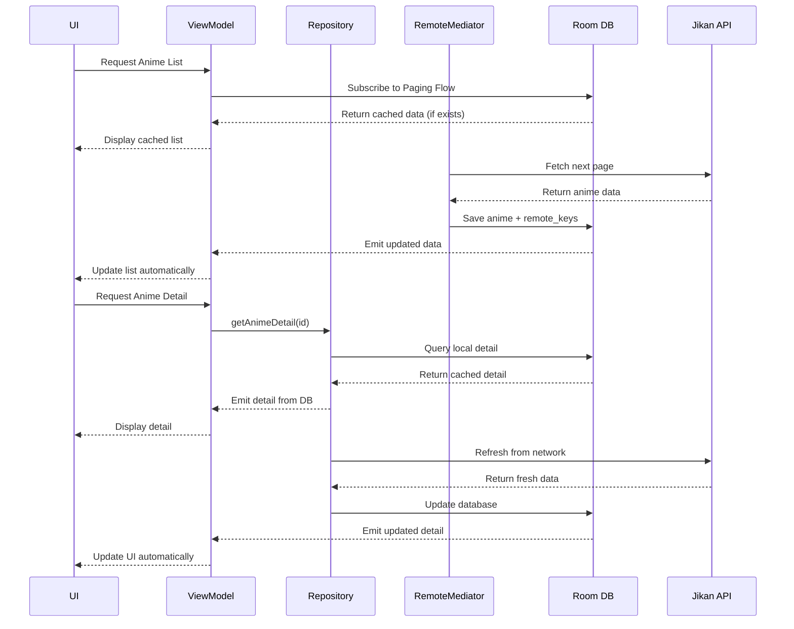
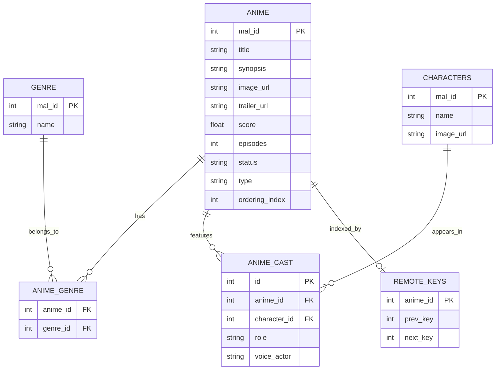

# Animeflix 

Animeflix is an Android application built with **Jetpack Compose** that displays a **paginated anime list**, **anime details**, and **cast** information using the **Jikan API (v4)**.

The app follows an **offline‑first architecture** where **Room Database is the Single Source of Truth (SSOT)**—the UI renders from local storage and the network is used to refresh/sync data.

---

## Repository Link

- GitHub: `https://github.com/palvishalcap/Animeflix`

---

## Features Implemented

- **Browse anime with smooth scrolling**
  - Explore a paginated anime catalog with posters, rating, and episode count.
- **Works offline after first load**
  - Previously loaded list pages and previously viewed anime details/cast remain available even without internet.
- **Anime details screen**
  - View title, synopsis, genres, and other key information in a single place.
- **Watch trailers inside the app**
  - If a trailer is available from the API, you can play it directly in the app.
- **Cast section**
  - View cast/character cards with images.
- **Fast loading experience**
  - Data is cached locally to reduce repeated network calls and improve load times.
---

## Tech Stack

- **Kotlin**
- **Jetpack Compose**
- **Room**
- **Paging 3 (Pager + RemoteMediator)**
- **Retrofit + OkHttp**
- **Dagger Hilt**
- **KSP** for annotation processing

---

## Architecture Overview

### Offline‑First Data Flow (SSOT)

- **Room is the Single Source of Truth**
  - The UI observes Room data (`Flow`)
  - Network is used to refresh/sync into the database

- **Paging**
  - `RemoteMediator` loads pages from the API and saves into Room
  - Paging UI reads from Room using a `PagingSource`

### Architecture Flow Diagram


**High-level flow:**

1. UI subscribes to DB (Paging list / detail flows)
2. `RemoteMediator` fetches list pages from network
3. Writes anime + remote keys into DB in a transaction
4. UI updates automatically from DB changes
5. Detail/cast refreshes sync network → DB and UI observes DB

### Data Flow Sequence



---

## Local Database Schema (Room)

### Entity-Relationship Diagram



**Tables** :

- `anime` - Stores anime details
- `genre` - Genre master data
- `anime_genre` - Many-to-many cross reference
- `characters` - Character master data (reusable)
- `anime_cast` - Links anime to characters with role info
- `remote_keys` - Paging RemoteMediator pagination keys
---

## Project Structure

## Project Structure (Clean Architecture)

The project follows a clean, layered structure where the UI depends on domain abstractions, and the data layer provides implementations (offline‑first with Room as SSOT).

### Package Layout (High-level)

```text
app/src/main/java/com/example/animeflix
├── di/
│   └── AnimeAppModule.kt
│
├── domain/
│   └── AnimeRepository.kt
│
├── data/
│   ├── api/
│   │   └── AnimeApiClient.kt
│   │
│   ├── datasource/
│   │   ├── AnimeRepoImpl.kt
│   │   ├── AnimeListRemoteMediator.kt
│   │   └── AnimeDetailMappers.kt
│   │
│   ├── db/
│   │   ├── AnimeDatabase.kt
│   │   ├── AnimeEntities.kt
│   │   ├── AnimeRelations.kt
│   │   ├── AnimeDao.kt
│   │   └── RemoteKeysDao.kt
│   │
│   └── model/
│       └── (Network response models)
│
├── ui/
│   ├── composables/
│   │   ├── AnimeListScreen.kt
│   │   ├── AnimeDetailScreen.kt
│   │   ├── AnimeListItem.kt
│   │   └── CastCard.kt
│   │
│   ├── navigation/
│   │   └── AnimeNavHost.kt
│   │
│   └── theme/
│       ├── AnimeViewModel.kt
│       └── (Theme / Color / Typography)
│
├── MainActivity.kt
└── AnimeFlixApplication.kt

```

## Assumptions Made

- **API Availability**: The Jikan API (v4) is assumed to be available and stable. The API enforces rate limits; normal browsing patterns are expected.

- **Network Connectivity (Initial Sync)**: Internet is recommended for the initial sync. After content is fetched, previously loaded list pages and previously viewed details/cast can be displayed offline from the local database.

- **Trailer Playback (In‑App)**: Trailer playback is supported when the API provides a valid trailer URL (e.g., YouTube/embed URL). Playback reliability depends on the availability/format of the trailer URL returned by the API.

- **Device Support**: The app targets Android SDK 24+ and assumes devices support Jetpack Compose.

---

## Known Limitations

- **Jikan API Rate Limits**: Rapid browsing/refreshing can trigger 429 Too Many Requests. The app surfaces errors gracefully, but users may need to wait before retrying.

- **Offline Coverage**: Offline mode works for content that has already been fetched and stored locally. Content that hasn't been synced yet won't be available offline.

- **Trailer Availability**: Some anime may not have trailers (or may have unsupported/empty trailer URLs), in which case the trailer section will not render.

- **Data Freshness**: There is no TTL-based cache invalidation policy; cached data may become stale until refreshed.

---

## Setup & Run

### Prerequisites

- Android Studio (latest stable recommended)
- Android SDK installed
- Emulator or physical device
- Internet connection recommended for first sync

### Steps

1. Clone the repository:
   ```bash
   git clone https://github.com/palvishalcap/Animeflix.git
   cd Animeflix
   ```

2. Open the project in Android Studio.

3. Sync Gradle.

4. Run the app configuration on an emulator/device.

---
